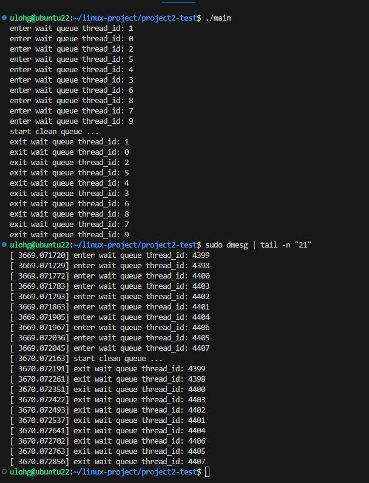

此為中央大學Linux Operating System 課程的兩個project

## 環境
- OS： ubuntu 22.04
- Kernel ： 5.15.137

## project內容
- 作業內容皆為**新增system call來模擬kernel處理的機制**
- project1-test 和 project2-test 為測試兩個專案的部分
- 此reop 只將system call的程式碼上傳,若要實作要先下載kerenl,並把code放入到kernel中,並且修改`syscall_64.tbl`,`Makefile`等等 詳細可以參考 `https://hackmd.io/aist49C9R46-vaBIlP3LDA?view`

### Project1 
- Write a new system call `void * my_get_physical_addresses(void *)` so that a process can use it to get the physical address of a virtual address of a process.
- The return value of this system call is either 0 or an address value. 
  - 0 means that there is no physical address assigned to the logical address currently. 
  - A non-zero value means the physical address of the logical address submitted to the system call as its parameter (in fact, this address is only the offset of a logical address).

實作概念
1. virtual address 會透過page table 轉換成physical address
2. 每個process的user space code 有自己獨立的page table 做轉換
3. 透過`task_struct`的`mm_struct `欄位可以獲得第一層page table 的physical address
4. linux 會透過4層或是5層的page table 層層做轉換
5. 利用copy_from_user和copy_to_user進行指標的傳輸,這樣可以避免惡意的程式可能會通過傳入錯誤或偽造的指標，導致內核錯誤地操作敏感資料或程式碼。copy_from_user會進一步的檢查user space傳進來的資料，就可以降低kernel被惡意攻擊的風險。

test code 主要針對
1. 轉換的正確性
2. copy on write 機制進行測試
3. link loader 在程式執行時是否會一次載入所有data

詳細報告內容:https://hackmd.io/@ldhujBfsSMi9KAU4lGge3w/HJZh2i2lkg

### Project2
implement a custom wait queue-like functionality in kernel space, allowing user applications to operate through the system call.

實作概念
1. 每個`wait queue`是一個 doubly linked list `head`（wait_queue_head_t），用來管理多個等待`node`（wait_queue_entry_t）。
2. 等待的thread會作為node加入 doubly linked list。
3. 喚醒thread時，kenrel 會從 doubly linked list 中取出node並執行相應的喚醒操作。
4. 利用`spinlock`保障多個thread同時訪問waiting queue時的data consistence。
 
test code 利用10 個thread模擬多個process 進入waiting queue的情況

